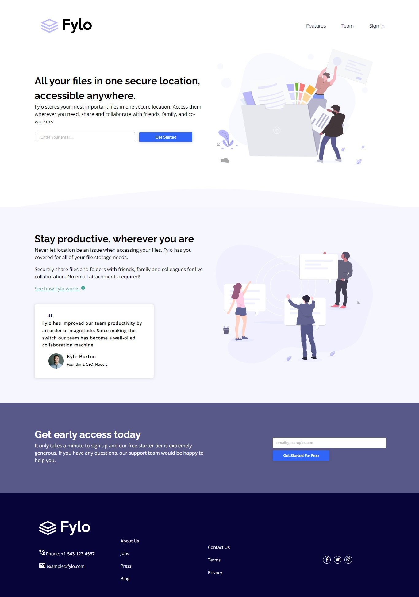
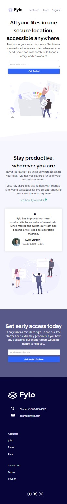

# Frontend Mentor - Fylo landing page with two column layout solution

This is a solution to the [Fylo landing page with two column layout challenge on Frontend Mentor](https://www.frontendmentor.io/challenges/fylo-landing-page-with-two-column-layout-5ca5ef041e82137ec91a50f5). Frontend Mentor challenges help you improve your coding skills by building realistic projects. 

## Table of contents

- [Overview](#overview)
  - [The challenge](#the-challenge)
  - [Screenshot](#screenshot)
  - [Links](#links)
  - [Built with](#built-with)
  - [Continued development](#continued-development)
  - [Author](#author)

## Overview

### The challenge

Users should be able to:

- View the optimal layout for the site depending on their device's screen size
- See hover states for all interactive elements on the page

### Screenshot

Desktop Version

Mobile Version

### Links

- Solution URL: [Code on GitHub](https://your-solution-url.com)
- Live Site URL: [Live Site](https://ninuolafs.github.io/fylo-landing-page/)

### Built with

- Semantic HTML5 markup
- CSS custom properties
- Flexbox
- CSS Grid
- Desktop-first workflow

### Continued development

Going forward, I will keep doing more practice projects to get better acquainted with the in and out of HTML and CSS

## Author

- Website - [Ninuola Femi-Sanni](https://ninuolafs.github.io/Personal-Site/)
- Frontend Mentor - [@Ninuolafs](https://www.frontendmentor.io/profile/Ninuolafs)
- Twitter - [@ninuola_fs](https://twitter.com/ninuola_fs)

